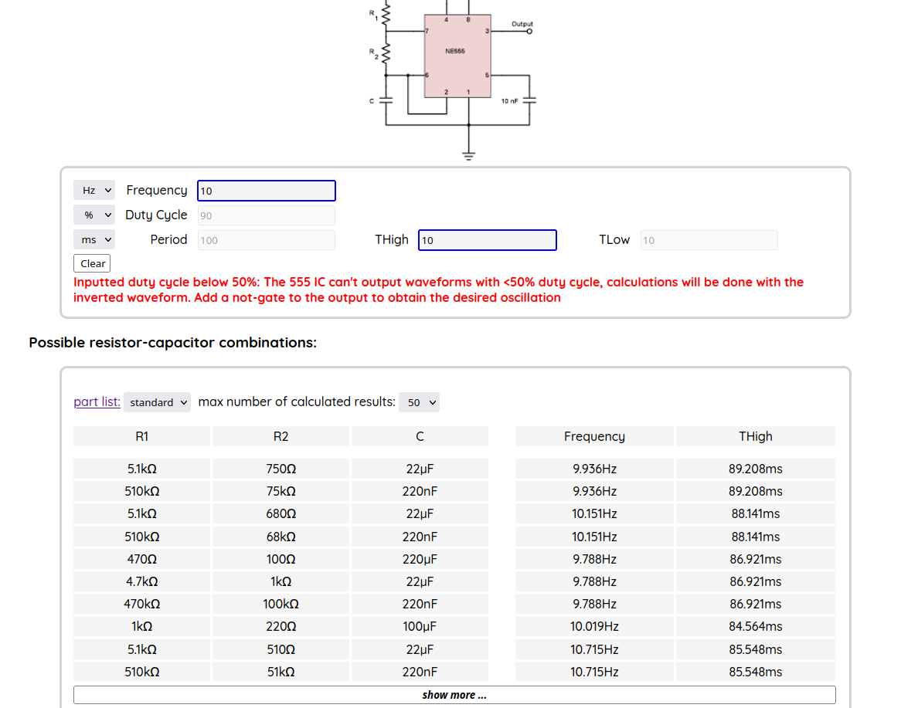

# 555calc

A tool for finding combinations common of components that will produce a desired oscillation in a 555 circuit.
Supports the monostable configuration aswell.

This tool will also automatically calculate all missing values that describe the waveform once you give it a combination of any 2 (like 440hz with 50% on time)

There are 2 component lists you can choose between, one with most commonly encountered components and one with only the really common ones (220R, 10k and such). If you are missing the best fitting components, the tool gives you a list of alternatives aswell, sorted by how well they match.
